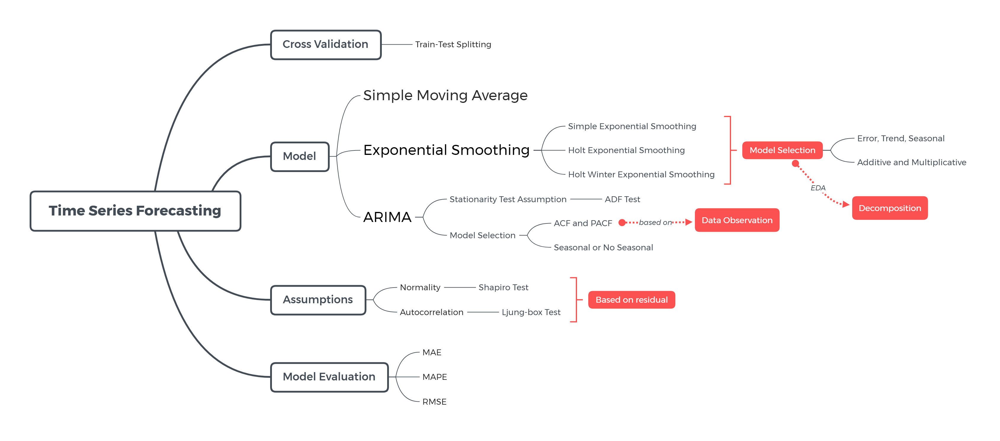
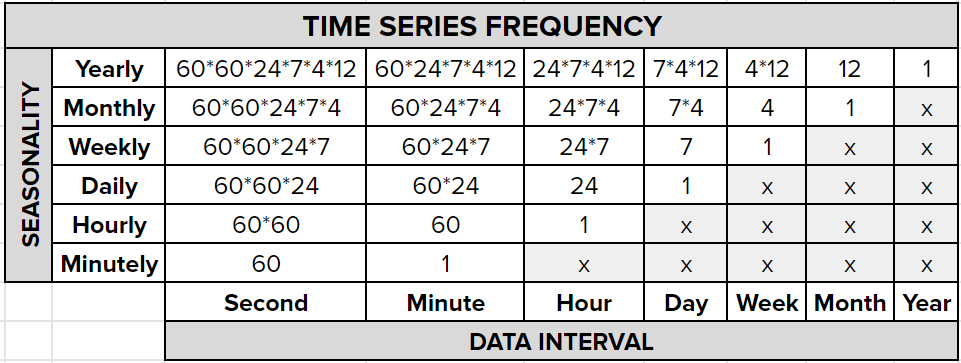
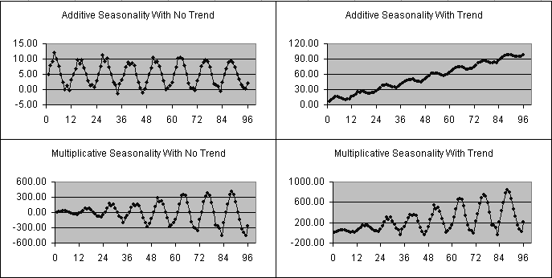
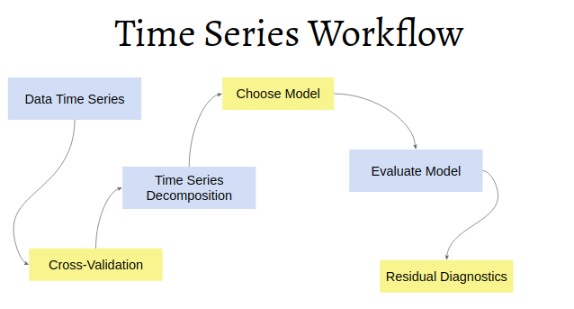

```{r setup, include=FALSE}
# clear-up the environment
rm(list = ls())

# chunk options
knitr::opts_chunk$set(
  message = FALSE,
  warning = FALSE,
  fig.align = "center",
  comment = "#>"
)

options(scipen = 999)
```

<style>
body {
text-align: justify}
</style>

# Pendahuluan {.tabset}

## Mind Map

```{r, echo=FALSE}

```

## Library

```{r warning=FALSE, message=FALSE}
library(tidyverse)
library(lubridate) # date manipulation
library(padr) # TS padding
library(zoo) # imputasi missing value TS
library(fpp) # TS dataset
library(TSstudio) # TS interactive viz

library(forecast) # algoritma forecasting
library(TTR) # SMA function
library(tseries) # adf.test

# supaya semua plot memiliki theme_minimal()
theme_set(theme_minimal())
```

# Time Series and Forecasting

**Time series** data merupakan data yang terurut berdasarkan waktu dan disampel pada interval yang sama.

**Forecasting** merupakan suatu metode untuk memprediksi/meramalkan data di masa depan

**Apa perbedaan Time Series Forecasting dengan Regresi?**

Regresi adalah prediksi berdasarkan prediktor atau faktor yang mempengaruhinya. Time series forecasting memprediksi berdasarkan nilai data di masa lalu.

*Regression*

$$y = \beta_0+\beta_1*x_1+\beta_2*x_2+...+\beta_n*x_n$$

*Time Series Forecasting*

$$y_t = \beta_0+\beta_1*y_{t-1}+\beta_2*y_{t-2}+...+\beta_n*y_{t-n}$$

Ide utama dalam melakukan forecasting itu adalah korelasi dari data numerik, atau disebut sebagai **autokorelasi**.

# Time Series Data

## Characteristics

Time series data: data yang berhubungan dengan waktu dan memiliki interval waktu yang tetap/sama.

Syarat utama data time series:

1. Data harus urut sesuai periode waktu dari data terlama sampai ke data terbaru
2. Interval waktunya harus tetap/sama
3. Tidak boleh data yang terlewat untuk setiap interval

**Knowledge Check**

Apakah data berikut sudah memenuhi syarat data time series yang baik?

1. Demand product

```{r}
df_demand <- data.frame(
  date = ymd(c("2021-5-3", "2021-5-4", "2021-5-6", "2021-5-7")),
  demand = c(29, 79, 41, 88)
  )

df_demand
```

**Kesimpulan:** Belum memenuhi karakteristik data TS yang baik, karena ada data yang terlongkap yaitu 5 Mei 2021.

2. Price product

```{r}
df_price <- data.frame(
  date = ymd(c("2021-5-16", "2021-5-19", "2021-5-18", "2021-5-17", "2021-5-20", "2021-5-21")),
  price = c(1000, 1001, 1002, 1003, 1004, 1005)
  )

df_price
```

**Kesimpulan:** Belum terurut berdasarkan waktu (date)

Perbaikan yang dapat dilakukan sesuai syarat time series:

- Mengurutkan data berdasarkan waktu: `arrange()`

```{r}
# mengurutkan df_price
df_price %>% 
  arrange(date)
```

- Melakukan padding untuk memastikan interval data sama: `pad()` dari package `padr`

Secara default, `pad()` akan menambal tanggal berdasarkan kolom yang tipe datanya date. Mengisi nilai yang terlewat atau missing (`NA`), cara yang umum dilakukan dengan package `zoo`:

+ `na.fill()`: mengisi `NA` dengan sebuah nilai, Gunakan `fill="extend"` untuk mengisi dengan nilai rata-rata dengan nilai yang missing 
+ `na.aggregate()`: nilai aggregasi (mean, median)
+ `na.locf()`: nilai terakhir sebelum missing

Note: metode untuk mengisi missing value disesuaikan dengan perspektif dari businessnya.

```{r}
# case: toko tutup di tanggal 5
# kita isi NA dengan nilai 0
df_demand %>% 
  pad() %>% 
  mutate(demand = na.fill(demand, 0))
```

## Time Series Object

Kita akan menggunakan data emisi CO2 di Indonesia di mana datanya sudah tersimpan dalam folder `data_input` dengan nama `environment_1970f.csv`.

```{r}
# read data
co2 <- read.csv("data_input/environment_1970f.csv")
head(co2)
```

Data `co2` terdiri dari 43 observasi yang mewakili kontribusi gas emisi per tahun terhadap atmosfer Indonesia (43 tahun, 1970-2012). Data ini terdiri dari 7 variabel, yaitu:

* `year`: tahun.
* `emisi co2 (kt)`: emisi yang berasal dari pembakaran bahan bakar fosil dan pembuatan semen, termasuk yang dihasilkan selama konsumsi.
* `emisi co2 (metrik ton per kapita)`: `idem`.
* `emisi metana (kt setara co2)`: emisi yang berasal dari aktivitas manusia (pertanian) dan dari produksi metana industri.
* `emisi nitro oksida (ribu metrik ton setara co2)`: emisi dari pembakaran biomassa pertanian, kegiatan industri, dan pengelolaan ternak.
* `emisi gas rumah kaca dan lainnya, HFC, PFC dan SF6 (ribu metrik ton setara co2)`: emisi hasil samping dari hidrofluorokarbon, perfluorokarbon, dan sulfur hexafluoride.
* `total emisi gas rumah kaca (setara dengan co2)`: total CO2 tidak termasuk pembakaran biomassa siklus pendek (pembakaran limbah pertanian dan savannah), tetapi termasuk pembakaran biomassa lainnya (kebakaran hutan, pembusukan pasca-pembakaran, kebakaran gambut, dan pembusukan lahan gambut yang dikeringkan), semua sumber CH4 antropogenik, sumber N2O dan gas-F (HFC, PFC, dan SF6).

Dari data `co2` ini, kita akan menggunakan 2 kolom:

- `year` untuk menunjukkan waktu
- `CO2.emissions..metric.tons.per.capita.` sebagai nilai yang kita amati untuk membuat object `ts`

1. Mengetahui range atau periode waktu data time series, gunakan `range()`

```{r}
range(co2$year)
```

2. Cek apakah data sudah memenuhi syarat data time series yang baik?

- pastikan terurut: ya, sudah terurut
- interval waktunya tetap: ya, data tahunan
- tidak ada waktu yang terlongkap: ya, semua sudah lengkap

```{r}
# memastikan apakah tahun sudah terurut dari 1970 sampai 2012
all(co2$year == seq(1970, 2012))
```

```{r}
seq(1970, 2012)
```

3. Mengetahui frequency data yang dimiliki berdasarkan:

- data yang disusun per periode apa?
- pola yang ingin dilihat apa (harian/mingguan/bulanan/kuartalan/tahunan)?

Berikut adalah contoh cara penentuan frequency:

- Jika saya memiliki data harian dan ingin mendapatkan pola mingguan, maka frequency = 7
- Jika saya memiliki data harian dan ingin mendapatkan pola bulanan, maka frequency = 7 * 4

```{r out.width="60%", fig.align='center', echo=FALSE}

```

**Knowledge Check**

Tentukan frequency dari data time series berikut:

- data total pengunjung cafe per jam, ingin dilihat pola harian, dengan asumsi buka 24 jam maka frequency = 24
- data total pengunjung cafe per jam, ingin dilihat pola harian, dengan asumsi hanya buka 12 jam, maka frequency = 12
- data total sales product per bulan, ingin dilihat pola tahunan, maka frequency = 12
- data total sales product per bulan, ingin dilihat pola kuartalan, maka frequency = 3

4. Membuat object ts dengan fungsi `ts()`

Parameter:

- `data`: **vector** numerik dari data time series
- `start`: periode awal (opsional)
  + diisi tahun jika data tahunan
  + diisi tahun dan quarter jika data quarterly
  + diisi tahun dan bulan jika data bulanan
- `frequency`: pola berulang pada data time series

data tahunan, kemudian kita mau lihat pola tahunan

```{r}
# membuat object ts
co2_ts <- ts(data = co2$CO2.emissions..metric.tons.per.capita., # vektor numerik
             start = 1970, # tahun awal
             frequency = 1) 
co2_ts
```

5. Visualisasi object `ts`

Gunakan `autoplot()` dari package `forecast`, yang mengembalikan object `ggplot`:

```{r}
library(forecast)
co2_ts %>% 
  autoplot()
```

Misalkan ingin cek pola pada tahun 1990 - 2000 saja, gunakan `window(start, end)`

window: melakukan subsetting pada object time series

```{r}
co2_ts %>% 
  window(start = 1990, end = 2000) %>% 
  autoplot()
```

**Insight**: Pergerakan emisi gas co2 di Indonesia secara umum naik, tapi ada yang menarik di tahun 1997-1998. Terjadi peningkatan emisi gas yang amat tinggi pada tahun 1997 yang mungkin disebabkan oleh [Kebakaran Hutan 1997](https://id.wikipedia.org/wiki/Kebakaran_hutan_Indonesia_1997)

**Diskusi:** Objek `co2_ts` berasal dari data yang direkam tahunan dan kita mengatur pola tahunan (frequency = 1). Apakah kita bisa menganalisis pola berulang (musimannya)?

Jawaban: **tidak bisa menganalisis pola berulang apabila frequency = 1**

**Note:** pemilihan frequency umumnya menggunakan ukuran waktu 1 level di atasnya, atau yang lebih atas lagi. (data harian dengan seasonality mingguan / bulanan / dst.)

## Exploring `nybirth` Data

1. Read data `nybirth.csv`

```{r}
birth <- read.csv("data_input/nybirth.csv")
glimpse(birth)
```

Data di atas merupakan data persentase kelahiran di New York per bulan. Terdiri dari:

- `date`: tanggal saat dilakukan pencatatan persentase kelahiran
- `births`: persentase kelahiran

Cek class data birth:

```{r}
class(birth)
# masih data frame
```

2. Lakukan data preprocessing:

- menyesuaikan tipe data `date`
- ekstrak informasi bulan dari `date` untuk keperluan visualisasi nantinya

```{r}
# gunakan fungsi dari package lubridate
birth_clean <- birth %>% 
  mutate(date = ymd(date),
         month = month(date, label = T))
birth_clean
```

3. Mengetahui range atau periode waktu data birth

```{r}
range(birth_clean$date)
```

4. Cek apakah data sudah memenuhi syarat data time series yang baik?

- data harus urut
- interval tetap (tidak ada yang terlongkap)
- tidak ada missing value

```{r}
birth_clean %>% 
  arrange(date) %>% 
  pad() %>% 
  anyNA()
```

**Kesimpulan:** data `birth_clean` sudah memenuhi ketiga karakteristik data TS, karena setelah diurutkan dan dilakukan padding, tidak ada missing value

5. Eksplorasi data

Visualisasi data sebelum mengubah menjadi object `ts` untuk mengetahui pola berulang pada data `birth`

```{r}
ggplot(data = birth_clean, aes(x = date, y = births)) +
  geom_point() +
  geom_line()
```

```{r}
ggplot(data = birth_clean, aes(x = date, y = births)) +
  geom_point() +
  geom_point(data = birth_clean %>% 
               filter(month %in% c("Jan", "Feb", "Jul")),
             aes(col = month)) +
  geom_line() +
  scale_color_manual(values = c("red", "blue", "yellow"))
```

**Insight**: Bagaimana pola dari data birth? ada pola yang berulang setiap 12 bulan (pola tahunan) karena setiap Feb tingkat kelahiran cenderung rendah, sedangkan tiap Jul cenderung tinggi.

6. Membuat object time series

```{r}
birth_ts <- ts(data = birth_clean$births,
               frequency = 12, # data bulanan, pola tahunan
               start = c(1946, 1)) # opsional, data awal = 1946 Jan
birth_ts
```

7. Visualisasi object ts:

Misal kita tertarik untuk visualisasi `birth` dari Jan 1950 sampai Des 1955 dengan `autoplot()`

```{r}
birth_ts %>% 
  window(start = c(1950, 1), end = c(1955, 12)) %>% 
  autoplot()
```

Opsional: Gunakan `ts_plot()` dari package `TSstudio` untuk visualisasi interaktif:

```{r}
birth_ts %>% 
  ts_plot()
```

## Decomposition

**Decomposition** adalah suatu tahapan dalam analisis time series untuk menguraikan data menjadi beberapa komponen dalam time series data, yaitu: 

* **Trend**: pola data secara umum, kecenderungan untuk naik atau turun
* **Seasonal**: pola musiman yang membentuk pola berulang pada periode waktu yang tetap
* **Error/Remainder/Random**: pola yang tidak dapat ditangkap dalam trend dan seasonal

Untuk dapat menguraikan object time series kita menjadi 3 komponen tersebut, kita dapat menggunakan fungsi `decompose()`.

```{r}
birth_dc <- birth_ts %>% 
  decompose()
```

Visualisasi hasil decompose:

```{r}
birth_dc %>% 
  autoplot()
```

**Notes:** Jika pada hasil decompose, trend masih membentuk sebuah pola maka dapat dicurigai masih ada seasonality yang belum ditangkap. Seharusnya trend cenderung naik atau cenderung turun secara smooth. Penyebabnya:

- frequency yang kita tetapkan belum tepat, atau
- terdapat multiseasonality pada data (keep untuk materi additional)

```{r}
# coba buat ulang object ts dari birth_clean tapi frequency = 4
ts(data = birth_clean$births, frequency = 4) %>% 
  decompose() %>% 
  autoplot()
```

**Notes:** Object time series dengan frequency = 1, tidak bisa dibuat decomposenya

```{r}
# co2_ts %>% 
#  decompose()

# time series has no or less than 2 periods
```

## Additive and Multiplicative

Terdapat 2 jenis model pada data time series, yaitu:

```{r out.width="60%", fig.align='center', echo=FALSE}

```

1. **Model Additive**: Model time series yang memiliki varians konstan mengikuti trend dan seasonalnya

$$Y_t = T_t + S_t + E_t$$

Data = Trend + Seasonal + Error

Contoh time series additive:

```{r}
birth_ts %>%
  autoplot()
```

2. **Model Multiplicative**: Model time series yang memiliki varians semakin tinggi/rendah mengikuti trend dan seasonal yang ada

$$Y_t = T_t * S_t * E_t$$

Data = Trend * Seasonal * Error

Contoh time series multiplicative:

```{r}
AirPassengers %>% 
  autoplot()
```

### (Optional) Perhitungan manual decompose Additive

Jika kita perhatikan lagi pada data `birth_ts` memiliki pola additive, karena varians dari polanya tetap atau konstan. Secara default, fungsi `decompose()` memiliki `type = "additive"`.

**Melakukan inspect komponen time series pada data `birth_dc`**

**1. Trend**

Trend diperoleh dari hasil perhitungan `center moving average (CMA)`. Tujuan utamanya untuk smoothing data sehingga diperoleh trend yang cenderung naik atau turun.

Berikut **pendekatan manual** untuk perhitungan trend, menggunakan fungsi `ma()`. Parameter:

- `x`: object TS
- `order`: berapa banyak data yang dilibatkan, menyesuaikan frequency
- `centre = T`: menggunakan center moving average

```{r}
# perhitungan manual, di mana order = frequency pada object TS
ma(birth_ts, order = 12, centre = T) %>% head(24)
```

Bandingkan dengan `$trend` dari `birth_dc`:

```{r}
# trend dari hasil decompose()
birth_dc$trend %>% head(24)
# hasilnya sama persis dengan perhitungan manual
```

**2. Seasonal**

Additive: **Data = Trend + Seasonal + Error**
Data de-trend: **Data - Trend = Seasonal + Error**

Data - Trend =  Seasonal + Error

```{r}
birth_detrend <- birth_ts - birth_dc$trend
```

**Pendekatan manual**

```{r}
# mean tiap bulan
mean_month <- birth_detrend %>%
  matrix(ncol = 12, byrow = T) %>% 
  colMeans(na.rm = T)
  
# mean global
mean_global <- mean(mean_month)

# nilai seasonality
mean_month - mean_global
```

Bandingkan dengan `$seasonal` dari `birth_dc`:

```{r}
# seasonal dari hasil decompose()
birth_dc$seasonal %>% head(12)
# hasilnya sama persis dengan perhitungan manual
```

**3. Error**

Additive: **Data = Trend + Seasonal + Error**
Additive error: **Error = Data - Trend - Seasonal**

```{r}
(birth_ts - birth_dc$trend - birth_dc$seasonal) %>% 
  autoplot()
```

Bandingkan dengan `$random` dari `birth_dc`:

```{r}
# error dari hasil decompose()
birth_dc$random %>% 
  autoplot()
# hasilnya sama persis dengan perhitungan manual
```

Inti dari perhitungan manual:

- Trend: menggunakan Center Moving Average
- Seasonality: Mean berdasarkan masing-masing periode (bulanan)
- Error: nilai sisanya, apabila additive yaitu data - trend - seasonality

**Istilah**:

- Remainder: dalam visualisasi
- Random: elemen dalam list `$random`
- Error: dalam pemodelan forecasting

### Multiplicative Time Series

Jika kita memiliki pola multiplicative pada data time series dan ingin membuat decomposenya cukup menambahkan parameter `type = "multiplicative"` pada fungsi `decompose()`. 

Ketika kita menemukan pola data kita mengandung multiplicative:

> Cara 1: transformasi data multiplicative menjadi additive dengan fungsi `log`. Setelah memperoleh hasil forecast kita dapat mengembalikan nilainya dengan `exp`.

```{r}
AirPassengers %>% 
  autoplot()
```

```{r}
# transformasi log
AirPassengers %>% 
  log() %>% 
  autoplot()
```

(Opsional) Sifat logaritma: perkalian menjadi penjumlahan

$$y = T * S * E$$ -> multiplicative
$$log(y) = log(T * S * E)$$
$$log(y) = log(T) + log(S) + log(E)$$ -> additive

> Cara 2: Tetap menggunakan model multiplicative, kemudian nanti hasil dibandingkan dengan memilih model dengan error yang paling kecil.

Parameter `type` dalam fungsi `decompose()`, secara default `type = "additive"`

```{r}
air_decom <- AirPassengers %>% 
  decompose(type = "multiplicative")

air_decom %>% 
  autoplot()
```

### (Opsional) Perhitungan manual decompose Multiplicative

**Trend**

Menggunakan Center Moving Average (CMA)

```{r}
ma(x = air_decom$x, order=12, centre = T) %>% head(12)
```

Bandingkan dengan trend di `air_decom`:

```{r}
air_decom$trend %>% head(12)
# hasilnya sama persis dengan perhitungan manual
```

**Seasonality**

Multiplicative: **Data = Trend * Seasonal * Error**
De-trend: **Data / Trend = Seasonal * Error**

```{r}
seasxerr <- air_decom$x /air_decom$trend

# mean of each month
mean_month <- seasxerr %>%
  matrix(ncol = 12, byrow = T) %>% 
  colMeans(na.rm = T)

# mean global
mean_global <- mean(mean_month)

# Seasonality Calculation
mean_month / mean_global
```

Bandingkan dengan seasonal di `air_decom`:

```{r}
air_decom$seasonal %>% head(12)
# hasilnya sama persis dengan perhitungan manual
```

**Error**

Multiplicative: **Data = Trend * Seasonal * Error**
Multiplicative Error: **Error = Data / Trend / Seasonal**

```{r}
(air_decom$x/air_decom$trend/air_decom$seasonal) %>% 
  autoplot()
```

Bandingkan dengan random di `air_decom`:

```{r}
air_decom$random %>% 
  autoplot()
# hasilnya sama persis dengan perhitungan manual
```

## Seasonality Analysis

Seasonality analysis membantu kita mengetahui di waktu mana saja yang nilai datanya tinggi/rendah pada periode seasonal yang kita amati. Kita bisa menggunakan informasi `$seasonal` untuk membuat visualisasi seasonal bar plot:

```{r}
# analisis seasonal dengan bar plot

birth_clean %>% 
  mutate(seasonal = birth_dc$seasonal) %>% # mengekstrak nilai seasonal
  distinct(month, seasonal) %>% # mengambil baris yang unique saja
  ggplot(aes(x = month, y = seasonal)) + # melakukan visualisasi
  geom_col()
```

## Seasonality Adjusted

Seasonality adjusted adalah data time series yang sudah dibuang efek seasonal nya. Umumnya digunakan untuk lebih mudah mendeteksi error/kejadian luar biasa/anomali dari data (tidak terganggu efek seasonal). Hal ini untuk kebutuhan exploratory data saja.

Berikut contoh data `birth_ts` yang sudah dibuang efek seasonalnya:

Model additive:

> Data = Trend + Seasonality + Error
> Data - Seasonality = Trend + Error

```{r}
# $x = data asli
# $seasonal = seasonality
(birth_dc$x - birth_dc$seasonal) %>%
  autoplot() %>% 
  plotly::ggplotly()
```

Visualisasi berikut menunjukkan line plot untuk Trend sekaligus Seasonal Adjusted data. Dengan seperti ini, kita dapat dengan mudah mendeteksi anomali (titik-titik data yang jauh dari trend nya).

> Credit to Pak Bayu Andrianto :)

```{r}
birth_dc$trend %>% 
  autoplot(series = "Trend") +
  autolayer(birth_dc$x - birth_dc$seasonal, series = "Seasonal adjusted")
```

# 📝 SUMMARY DAY 1

* Perbedaan regresi dengan forecasting
  - regresi: predictornya menggunakan variable lainnya (independent)
  - forcasting: predictornya menggunakan variable target itu sendiri di waktu lalu

* Tahap pengolahan data time series:

1. Memastikan data sudah memenuhi syarat:
  - Tidak ada missing value (NA) -> imputasi
  - Data urut berdasarkan tanggalnya -> sorting arrange()
  - Interval waktu tetap, tidak boleh ada yang terlongkap -> padding pad()
  
2. Membuat ts object dengan fungsi `ts()`. Parameter:
  - `data`: vektor numerik
  - `start`: tanggal awal
  - `frequency`: pola berulang yang ingin ditangkap
  
3. Visualisasi object ts dengan `autoplot()`:
  - Mengetahui apakah additive atau multiplicative
  - Additive: variansi konstan/tetap
  - Multiplicative: variansi berubah (besar/kecil)
  
4. Melakukan decompose dengan `decompose()` menjadi 3 komponen:
  - trend: naik/turun
  - seasonality: pola musiman/berulang
  - error: pola yang belum tertangkap oleh trend dan seasonality

Tujuan melakukan decomposition:
  - insight dari trend dan seasonal
  - mengetahui apakah frequency yang kita set sudah tepat atau belum.

***

DAY 2

# Forecasting

Metode:

1. Simple Moving Average (SMA)
2. Exponential Smoothing (ets = error trend seasonal)
   - Simple/Single Exponential Smoothing (SES) 
   - Double Exponential Smoothing (Holt Exponential Smoothing)
   - Triple Exponential Smoothing (Holt Winters Exponential Smoothing)
3. Auto Regressive Integrated Moving Average (ARIMA)
4. Seasonal Auto Regressive Integrated Moving Average (SARIMA)
5. Additional: Seasonal Trend with Loess Model (STLM)

## Simple Moving Average (SMA)

Metode ini menggunakan rataan bergerak (moving average) untuk melakukan smoothing data. Karena menggunakan rataan, maka bobot yang digunakan sama untuk setiap observasi di masa lalu.

$$y_t = \frac{y_{t-1}+y_{t-2}+...+y_{t-n}}{n}$$

**SMA tepat digunakan untuk data yang tidak mengandung trend dan tidak ada seasonal**

trend: pola data secara umum apakah naik/turun
seasonal: pola berulang

```{r}
y <- c(3, 4, 5, 6)
mean(y)

(3+4+5+6)/4

1/4 * 3 + 1/4 * 4 + 1/4 * 5 + 1/4 * 6
```

SMA: berdasarkan rata-rata, dan tiap datanya memiliki bobot yang sama

1. Import data

Kita menggunakan data curah hujan tahunan dari tahun 1813-1912 (100 tahun) di London, England.

```{r}
library(TTR)
rain <- scan("data_input/precip1.dat", skip = 1)
head(rain)
```

Note: `skip = 1` untuk melongkap 1 observasi pada file .dat, karena ada tulisan "Total".

2. Buat objek time series

data tahunan -> pola tahunan

```{r}
rain_ts <- ts(data = rain,
              start = 1813, # tahun awal
              frequency = 1)
rain_ts
```

Apakah data rain dapat di-decompose? frequency = 1, tidak bisa dilakukan decompose

3. Visualisasikan data

```{r}
rain_ts %>% 
  autoplot()
```

Istilah: Data curah hujan tidak memiliki trend dan seasonal, atau bisa kita sebut sebagai **data stasioner**.

4. Fitting Model SMA dengan ordo 3

Fungsi yang digunakan untuk fitting model dengan metode SMA adalah `SMA()` dari package `TTR` dengan parameter: 

- `x`: objek time series
- `n`: ordo

```{r}
rain_sma3 <- SMA(rain_ts, n = 3) # melihat 3 data kebelakang
rain_sma3
```

5. Visualisasi data actual dan hasil smoothing SMA dengan `autolayer()`

```{r}
rain_ts %>% 
  autoplot(series = "Rain") +
  autolayer(rain_sma3, series = "SMA(3)")

# series = label di legend
```

**Knowledge Check:** Misal kita gunakan SMA3 untuk forecast tahun 1913, maka nilainya adalah 26.01

```{r}
# manual
tail(rain_ts, 3) %>% mean()
```

```{r}
# prediksi nilai di masa depan
library(forecast)
forecast(rain_sma3, h = 1)
```

Kelemahan SMA:

- Hanya `n` data ke belakang
- Pembobotan yang sama pada tiap waktunya, baik untuk nilai di waktu terbaru maupun di masa lalu

## Exponential Smoothing

Pada exponential smoothing, bobot yang digunakan menurun secara eksponensial. Data yang lebih baru akan diberikan bobot yang lebih besar dibandingkan data yang sudah lama. Metode exponential smoothing terbagi menjadi 3 yaitu:

- Single/Simple Exponential Smooting/SES: **no trend, no seasonal**
- Double Exponential Smooting/Holt Exponential Smoothing: **ada trend, no seasonal**
- Triple Exponential Smooting/Holt-Winters Exponential Smoothing: **ada trend, ada seasonal**

Fungsi yang digunakan untuk membuat model exponential smoothing, yaitu:

1. `HoltWinters()`, parameter yang digunakan, yaitu:

- `x`: objek time series
- secara default parameter `alpha`, `beta`, dan `gamma` adalah **NULL**. Parameter harus diubah menjadi **FALSE** apabila komponen tersebut tidak ada.

  - `alpha` = smoothing untuk error, nilainya antara 0 - 1 
  - `beta` = smoothing untuk trend, nilainya antara 0 - 1
  - `gamma` = smoothing untuk seasonal, nilainya antara 0 - 1
  - `seasonality` = jenis model, apakah additive/multiplicative
  
ets -> bobot abg
  
**SES**: `HoltWinters(x, beta = F, gamma = F)`

$$y_{t+1} = \alpha y_{t} + \alpha (1-\alpha)y_{t-1}+\alpha(1-\alpha)^2y_{t-2}+...$$

* alpha mendekati 1 artinya observasi yang paling baru diberikan bobot jauh lebih tinggi dibandingkan data di waktu yang lama
* alpha mendekati 0 artinya observasi yang paling baru tetap memiliki bobot yang lebih tinggi namun tidak berbeda jauh dibandingkan dengan bobot di waktu yang lama

**Double/Holt Exponential Smoothing**: `HoltWinters(x, gamma = F)`

$$y_{t+h|t} = \ell_t +hb_t$$
$$\ell_t = \alpha y_t+(1-\alpha)(\ell_{t-1}+b_{t-1})$$
$$b_t = \beta^{*}(\ell-\ell_{t-1}) +(1-\beta^{*})b_{t-1}$$

**Triple/Holt Winters Exponential Smoothing**: `HoltWinters(x)`

$$y_{t+h|t} = \ell_t +hb_t+s_{t+h-m(k+1)}$$
$$\ell_t = \alpha y_t+(1-\alpha)(\ell_{t-1}+b_{t-1})$$
$$b_t = \beta^{*}(\ell-\ell_{t-1}) +(1-\beta^{*})b_{t-1}$$
$$s_t = \gamma(y_t-\ell_{t-1}-b_{t-1})+(1-\gamma)s_{t-m}$$

### Simple Exponential Smoothing (SES)

SES baik digunakan untuk data time series yang *tidak mengandung trend dan tidak seasonal*. SES akan melakukan smoothing terhadap komponen error/random. 

Kita akan menggunakan data curah hujan untuk melakukan fitting model dan forecasting menggunakan metode SES.

```{r}
rain_ts %>% 
  autoplot()
```

Cross validation: train-test splitting

- splitting tidak boleh random, harus terurut
- data test harus data terbaru

```{r}
# 20 tahun terakhir untuk test
rain_test <- tail(rain_ts, 20)

# 80 tahun untuk train (sisanya)
rain_train <- head(rain_ts, -20) # ekuivalen dengan head(rain_ts, 80)
```

Fitting Model dengan fungsi `HoltWinters()`

ets => parameter abg

no trend, no seasonal -> beta = F, gamma = F

```{r}
rain_ses <- HoltWinters(rain_train, beta = F, gamma = F)
rain_ses
```

Note: secara default fungsi `HoltWinters()` akan mencari parameter smoothing yang menurutnya optimal -> meminimalisir error di data train. "Optimal" itu belum tentu the best model.

Apabila ingin set nilai smoothing sesuai keinginan: `HoltWinters(rain_train, alpha = 0.8, beta = F, gamma = F)`

Forecasting dengan fungsi `forecast()`

```{r}
rain_forecast <- forecast(rain_ses, h = 20) # panjang data test

rain_forecast %>% 
  autoplot()
```

Parameter: h = horizon (berapa waktu kedepan yang ingin di-forecast?)

Output:

- Point Forecast (`$mean`): nilai forecasting di masa depan
- Lo 80: batas bawah interval forecasting dengan confidence level 80%
- Hi 80: batas atas interval forecasting dengan confidence level 80%
- Lo 95: batas bawah interval forecasting dengan confidence level 95%
- Hi 95: batas atas interval forecasting dengan confidence level 95%

Visualisasi data actual dengan hasil forecasting SES

```{r}
rain_ts %>% 
  autoplot(series = "Actual") +
  autolayer(rain_forecast$fitted, series = "Train") +
  autolayer(rain_forecast$mean, series = "Test")
```

Note:

- `$fitted` untuk hasil forecast di data train
- `$mean` untuk hasil forecast di data test

Evaluasi model dengan fungsi `accuracy()` dari library `forecast`

Parameter: object_forecast dan object_ts_test

```{r}
accuracy(rain_forecast, rain_test)
```

Train: 13.7%
Test: 13.72%

Metric evaluasi:

- ME: Mean Error
- **RMSE: Root Mean Squared Error**
- **MAE: Mean Absolute Error**
- MPE: Mean Percentage Error
- **MAPE: Mean Absolute Percentage Error**
- MASE: Mean Absolute Scaled Error
- ACF1: Autocorrelation of errors at lag 1.
- Theil's U: RMSE divided by RMSE of naive model $y_t = y_{t-1}$. Idealnya di bawah 1

### Double Exponential Smoothing / Holt Exponential Smoothing

Holt digunakan untuk data time series yang mengandung **trend, namun tidak seasonal**. Holt akan melakukan smoothing terhadap komponen error/random dan trend.

Kita akan menggunakan data kontribusi emisi gas CO2 di Indonesia untuk melakukan fitting model dan forecasting menggunakan metode holt.

```{r}
co2_ts %>% 
  autoplot()
```

Note: ingat, karena frequency = 1 kita tidak dapat melakukan `decompose()`

Cross validation

```{r}
# 3 tahun terakhir untuk test
co2_test <- tail(co2_ts, 3)

# 40 tahun untuk train (sisanya)
co2_train <- head(co2_ts, -3)
```

Fitting Model Double Exponential Smoothing (DES)

ets => parameter abg

ada trend, tidak ada seasonal -> gamma = F

```{r}
co2_des <- HoltWinters(co2_train, gamma = F)
co2_des
```

Hati-hati: Jangan set nilai parameter smoothing menjadi `TRUE`. Contoh kalau `beta = T` artinya `beta = 1`

Forecasting

```{r}
co2_forecast <- forecast(co2_des, h = 3) # panjang data test
```

Visualisasi data actual dengan hasil forecasting

```{r}
co2_ts %>% 
  autoplot(series = "Actual") +
  autolayer(co2_forecast$fitted, series = "Train") +
  autolayer(co2_forecast$mean, series = "Test")
```

Evaluasi model

```{r}
forecast::accuracy(co2_forecast, co2_test)
```

MAPE:

- Train = 5.81%
- Test = 14.13% (overfitting)

Tindak lanjut:

- Tuning alpha, beta
- Gunakan model lain

### Triple Exponential Smoothing / Holt-Winters

Holt winters digunakan untuk data time series yang mengandung *trend dan seasonal*. Holt winters melakukan smoothing terhadap komponen error/random (alpha), trend (beta), dan seasonal (gamma). 
Kita akan menggunakan data persentase kelahiran di New York untuk melakukan fitting model dan forecasting menggunakan metode holt winters.

```{r}
birth_ts %>% 
  autoplot()
```

Cross validation

```{r}
# 3 tahun (36 bulan) terakhir untuk test
birth_test <- tail(birth_ts, 3*12)

# sisanya untuk train
birth_train <- head(birth_ts, -3*12)
```

Fitting Model

Secara default HoltWinters akan menganggap data sebagai additive seasonality (`seasonal = "additive"`). Apabila data berupa multiplicative, gunakan parameter `seasonal = "multiplicative"` di dalam fungsi `Holtwinters()`.

```{r}
birth_hw <- HoltWinters(birth_train, seasonal = "additive")
birth_hw
```

Forecasting

```{r}
birth_forecast <- forecast(birth_hw, h = 3*12)
```

Visualisasikan data actual dengan hasil forecasting holt winters

```{r}
birth_ts %>% 
  autoplot(series = "Actual") +
  autolayer(birth_forecast$fitted, series = "Train") +
  autolayer(birth_forecast$mean, series = "Test")
```

Evaluasi Model

```{r}
forecast::accuracy(birth_forecast, birth_test)
```

MAPE:

- Train: 2.347%
- Test: 3.016%

> Fungsi `ts_grid()` pada package `TSstudio`

### Fungsi ets()

2. `ets()` dari library `forecast` yang merupakan *error, trend, dan seasonal*. Parameter yang digunakan, yaitu:

- `y`: objek time series.
- `model`: model/pola time series untuk **error, trend, dan seasonal**. 
   1. `A`: additive
   2. `M`: multiplicative
   3. `N`: none
   4. `Z`: auto -> berdasarkan AIC (information loss, semakin kecil semakin baik)
- `alpha`: bobot untuk smoothing error, nilainya antara 0 - 1. 
- `beta`: bobot untuk smoothing trend, nilainya antara 0 - 1.
- `gamma`: bobot untuk smoothing seasonal, nilainya antara 0 - 1.

Jika bobot semakin mendekati 1, maka nilai prediksi/forecast lebih mempertimbangkan data terbaru.

**Single Exponential Smooting/SES**: `ets(y, model = "*NN")`

**Double Exponential Smooting/Holt**: `ets(y, model = "**N")`

**Triple Exponential Smooting/Holt Winters**: `ets(y, model = "***")`

* artinya dapat diisi dengan A/M/Z

```{r}
birth_ts %>% 
  autoplot()
```


```{r}
birth_ets <- ets(birth_train, model = "AAA")
birth_ets
```

Cobalah dengan parameter `model`:

- ZZZ -> AIC = 544.7426 (information loss)
- AAA -> AIC = 544.1604

Forecasting

```{r}
birth_ets_forecast <- forecast(birth_ets, h = 3*12) # panjang data test
```

Visualisasikan data actual dengan hasil forecasting holt winters

```{r}
birth_ts %>% 
  autoplot(series = "Actual") +
  autolayer(birth_ets_forecast$fitted, series = "Train") +
  autolayer(birth_ets_forecast$mean, series = "Test")
```

Evaluasi Model

```{r}
forecast::accuracy(birth_ets_forecast, birth_test)
```

Bandingkan performa model forecasting data birth dengan fungsi `HoltWinters()` dengan `ets()`:

Fungsi HoltWinters: 

- Training -> MAPE 2.347%
- Testing -> MAPE 3.016%

Fungsi ets (AAA):

- Training -> MAPE 1.827651%
- Testing -> MAPE 2.142523%


## 📝 SUMMARY DAY 2

* TS Workflow:

```{r out.width="60%", fig.align='center', echo=FALSE}

```

* Simple Moving Average (SMA):
  - (yes/no) trend (yes/no) seasonal
  - bobot untuk tiap observasi (sama/berbeda)
    
* Exponential smoothing:
  - Single / Simple: (yes/no) trend (yes/no) seasonal
  - Double / Holt: (yes/no) trend (yes/no) seasonal
  - Triple / Holt-Winters: (yes/no) trend (yes/no) seasonal

* Parameter smoothing:
  - alpha: untuk smoothing (error/trend/seasonal)
  - beta: untuk smoothing (error/trend/seasonal)
  - gamma: untuk smoothing (error/trend/seasonal)
  - parameter smoothing semakin mendekati nilai ... artinya bobot data baru dianggap jauh lebih penting dibandingkan data yang sudah lama
  
* Aturan cross validation dalam TS: 
  - Metode pengambilan: (random sampling/sequential)
  - Pengambilan data test sebaiknya ...

# References

- [Textbook Forecasting: Principles and Practice](https://otexts.com/fpp2/)
- [Google Sheet: Perhitungan TS](https://docs.google.com/spreadsheets/d/13ohWXubiZW6yQtycrxYfWqD-A7rBoeOhaR1VBw_uINA/edit?usp=sharing)
- [Package `zoo`](https://www.jstatsoft.org/article/view/v014i06/v14i06.pdf)